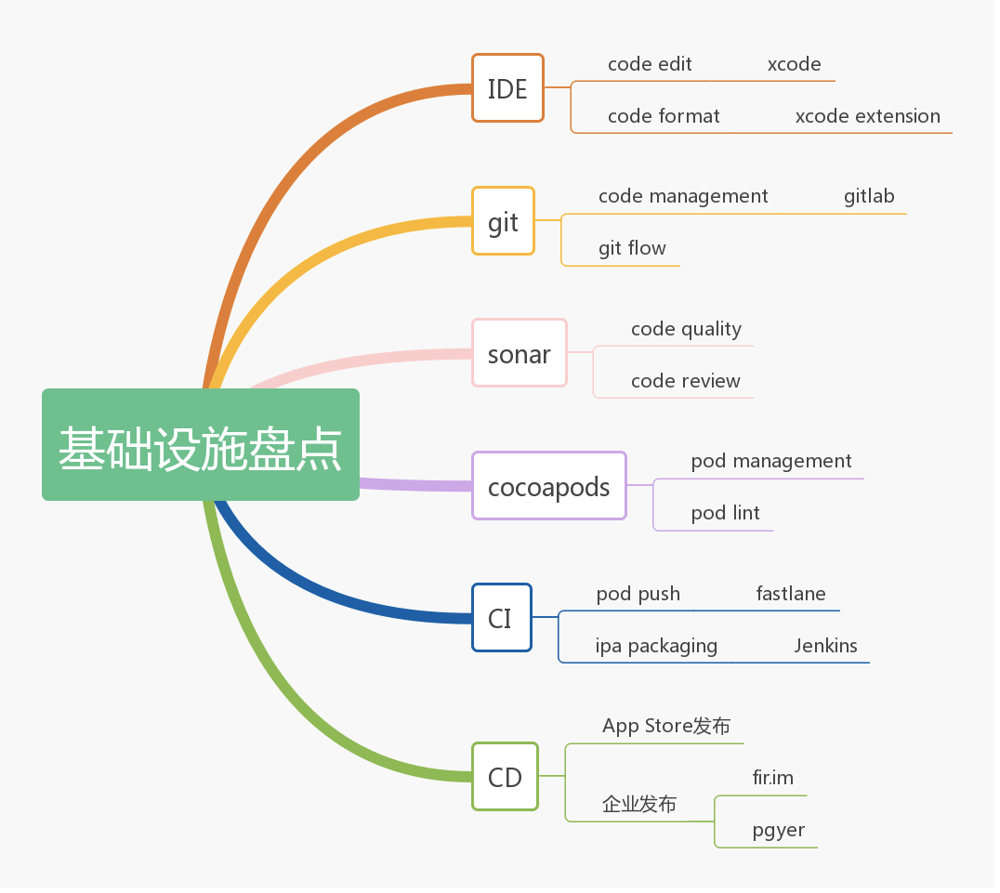
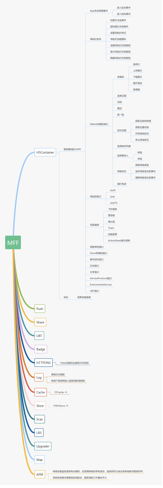

## 基础设施盘点

对 iOS 开发过程中的基础设施做了下盘点，暂时只罗列一些笔者目前接触到的或者觉得还不错的。这些基础设施是我们完成 iOS App 构建过程的辅助工具，不过每项工具都是独立的，需要我们自己将这些工具尽可能的串联起来。

## 构建步骤

- code formatting，最容易被忽略掉的一个步骤，其实是非常重要的，代码格式化的重要性不亚于好的命名，所有人写的代码格式都统一，阅读代码的人自然赏心悦目。如果一开始没有设好代码的格式并始终遵循，后续的代码格式将无法管控。当意识到这个问题的重要性之后，将所有代码格式化产生的代码冲突可能会让人生不如死。以至于 golang 专门整了个格式化的工具；

- code management，代码托管这个步骤没什么好说的，git 一统天下，git flow 要烂熟于心；

- code quality，也是很容易被忽略掉的一个步骤，其实对代码质量的提高有一定的作用，解决不了业务逻辑上的错误，但是至少可以解决代码的坏味道。不过 Objective-C 语言的规则还是有点少，也不太友好，因为语言的特殊性没考虑到，Objective-C 的变量命名长度很轻松就超过 22 个字符；

- code review，就我个人的经验，这个步骤是一直在强调，效果一般吧，很多时候是把上一个步骤的事情给做了；

- pod management，这一步最需要注意的是将 pod 标准化，cocoapods 本身提供了一个 pod template，唯一要做的就是调整成我们需要的版本就好了；

- pod lint，很多时候跟着 pod pushing 一起完成掉了；

- pod pushing，pod 上传切记不要跳过 pod lint 这一步，虽然 cocoapods 有时候会出一些莫名其妙的问题，不过还是不建议跳过；

- ipa packaging，这一步看似简单，在这一步之前的一堆代码合并动作其实不简单，如何处理好其实是最难的；

- ipa publish，这一步是必经之路吧，都不上线还玩啥。

以上所有的步骤中，最应该花时间的是 code editing，其次是 code review，剩下的都应该自动化、脚本化。

## 步骤自动化

自动化的目的还是为了节省人的等待时间，小巧的脚本终究可以通过组合做到“没有什么是一行命令解决不了的”，而且是可以一劳永逸的事情。

- code formatting 应该在保存的时候自动触发格式化，不过 xcode8 之后之前所有美好的插件都消失了，取而代之的是 xcode extension，没以前那么好用了；

- code management 这一步非常多的人会使用 source tree，其实直接使用 git 命令行是最好的，虽然可能一开始入门花的时间较多，但是命令行的好处实在太多了，反过来说，还有什么比 git 更值得琢磨的工具嘛？

- pod lint & pod pushing，理想情况下打 tag 并在 tag 上带上版本号之后，自动触发 podspec 文件中版本号的更新，同时进行 pod lint & pod pushing；

- ipa packaging & ipa publish，Jenkins 一般都能搞定，也可以通过 fastlane 来解决，脚本更灵活，本地也可以跑。

## 架构设计

iOS 的架构设计包括技术架构、业务架构，这里技术架构主要是指技术层面的分层模型，如 MVC/MVVM 等，使用何种开发框架、库等，技术架构很多情况下做的是业务无关的决策；业务架构完整的说法应该是业务系统架构，包括业务线、业务模块的划分等，如登录注册模块、权限认证模块、钱包模块等，业务架构必然是做业务相关的决策。

> 模块，业务相关的，当我们在说模块的时候，一定指的是业务模块。

### 1. 业务模块化

业务架构主要是解决合理划分业务模块的问题，业务模块在整个系统内应该类似于子系统的概念，不过有别于一般的子系统只是接口层面的依赖，在 iOS App 上的业务模块还存在界面之间的依赖，所以业务模块的划分会更难，还需要进行页面之间的解耦。所以业务模块之间天然需要解决页面跳转的路由。

因为业务模块可能包含页面，而页面的生命周期明显跟 App 的生命周期是不一致的，随着页面的出现和消失而变化。页面只能管理页面生命周期内的状态，不在页面生命期内的状态则需要由服务来管理，服务可以灵活的注册和注销。服务和页面是业务模块的基本构成，由页面组成的业务模块定义为功能模块，由服务组成的业务模块定义为服务模块，一个业务模块可以同时包含功能模块和服务模块。业务模块如何划分呢？可以参考共同重用原则和共同封闭原则。

下图是不太复杂的 App 的一个业务模块化方案

- Mobile Business Framework，主要是提供业务模块相关的基础类库；
- Mobile Foundation Framework， 主要是提供业务无关的基础类库；
- App Service Protocols，提供服务的协议定义；
- App Functional Components，提供 App 基础的组件，类似 ScanView，AlertView，Toast 等；
- Business Module，内部可能包含 Service Module 和 Functional Module 的内容，Module Functional Components 是当前模块的组件；

> 功能模块的划分会随着业务的变化而调整

对 Mobile Business Framework 的一些注解：
ServiceManager 提供 service register，service unregister，service get by Protocol；
RoutingService 解决页面导航的问题，url register，url push，url present；
AppLifeCycleService 提供 App 生命周期的回调；
EventService 是事件总线，提供比 Service 本身更轻量级的通信，如果了解 Command-Query 模式的话，时间总线在这类似于 Command 的作用，Service 本身更偏重于 Query 的作用；

### 2. 业务线模块化

当 App 复杂到需要分业务线的时候，从业务上看，每条业务线实际上在开发一个自己的 App，对整个 App 的模块化实际上会更复杂，单纯的业务模块化是不够的，我们需要在这个层面上增加子应用的概念，每个业务线维护一个 SubApp。

每个 SubApp 的 Service Protocols 和 Functional Components 还是局限于业务线内，SubApp 之间的通信和组件复用主要是由两者来完成。SubApp 内的功能模块不能超出业务线的边界。

### 3. 模块间交互流程图

遵循 CQS 原则，Command 的情形提供了 EventService 来完成，模块间比较轻量级的通信，Query 的情形提供了 ServiceProtocol 来完成。

事件调用流程如下图

服务调用流程如下图

EventService 比较轻量，可以取代系统提供的通知。
ServiceProtocol 也可以完成 EventService 的功能，但是较重。

### 4. Mobile Foundation Framework

